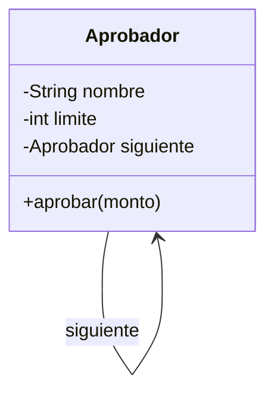

# Chain of Responsibility

**Categoría:** Comportamiento

**Propósito:** Pasar una solicitud a través de una cadena de manejadores hasta que uno la procese.

**Uso Real:** Sistema de aprobación de gastos donde según el monto se escala a supervisor, gerente o director.

## Diagrama UML

