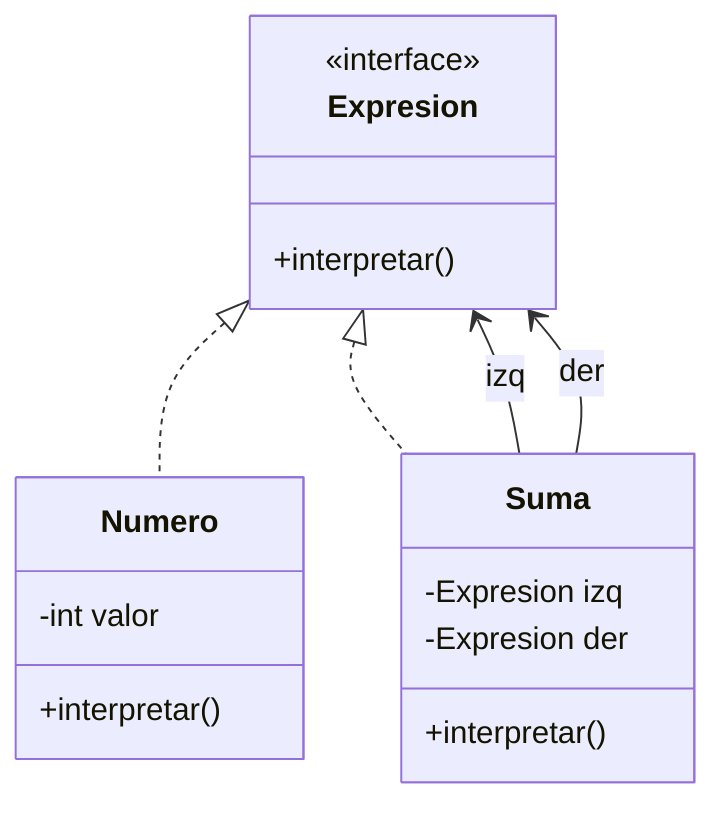

# Interpreter

**Categoría:** Comportamiento

**Propósito:** Definir una gramática simple e interpretar sentencias de ese lenguaje.

**Uso Real:** Calculadora que interpreta expresiones matemáticas como "5 + 3".

## Diagrama UML

