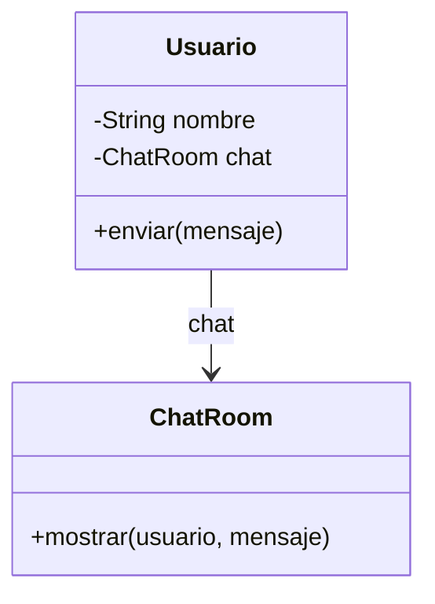

# Mediator

**Categoría:** Comportamiento

**Propósito:** Centralizar la comunicación entre objetos para reducir dependencias directas.

**Uso Real:** Chat grupal donde los mensajes pasan por un servidor central en lugar de enviarse directamente entre usuarios.
<<<<<<< HEAD
=======

## Diagrama UML

>>>>>>> fa27711533923cdc89b4ad4604b38f877fa7e4fd
