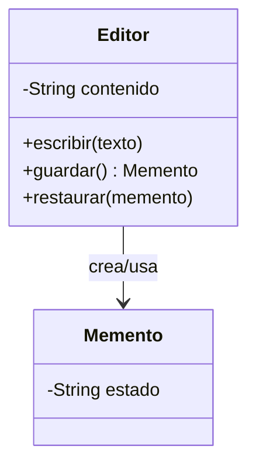

# Memento

**Categoría:** Comportamiento

**Propósito:** Guardar y restaurar el estado de un objeto sin exponer su estructura interna.

**Uso Real:** Editor de texto con función de deshacer (Ctrl+Z) que guarda versiones anteriores del documento.

## Diagrama UML

