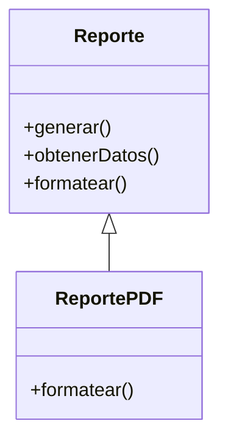

# Template Method

**Categoría:** Comportamiento

**Propósito:** Definir el esqueleto de un algoritmo permitiendo que las subclases redefinan ciertos pasos.

**Uso Real:** Proceso de generación de reportes donde el formato (PDF, Excel) cambia pero los pasos generales son iguales.

## Diagrama UML

