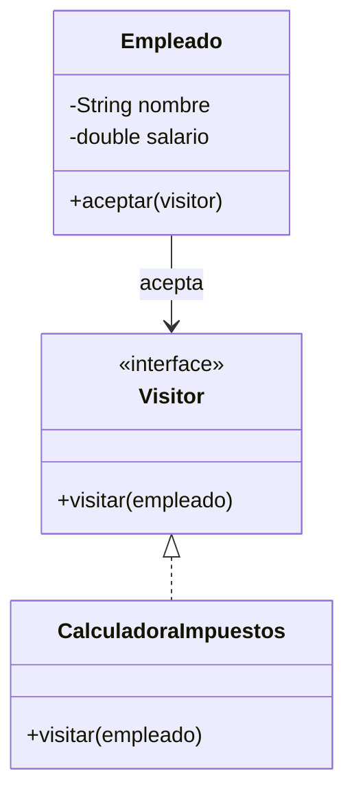

# Visitor

**Categoría:** Comportamiento

**Propósito:** Separar operaciones de la estructura de objetos, permitiendo agregar nuevas operaciones sin modificar las clases.

**Uso Real:** Sistema de nómina que calcula impuestos diferentes para empleados y contratistas sin modificar sus clases.

## Diagrama UML

